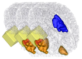
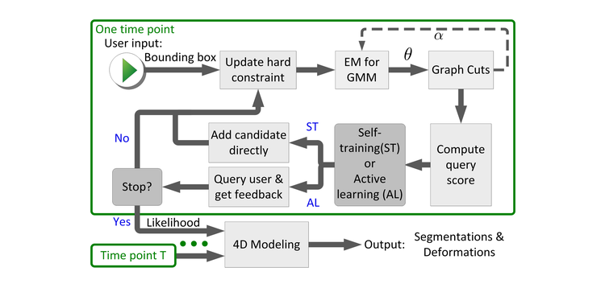

## ActiveCut
Active learning-based interactive segmentation tool for biomedical image with pathologies (lesion, tumor, etc.)


### Overview of the proposed algorithm


### Citation

If you find the code useful in your research, please consider citing:

    @inproceedings{WangISBI2014,
        title = {4D active cut: An interactive tool for pathological anatomy modeling},
        author = {Wang, Bo and Wei, Liu and Prastawa, Marcel and Irimia, Andrei and Vespa, Paul M and Van Horn, John D and Fletcher, P. Thomas and Gerig, Guido},
        booktitle = {{IEEE} 11th International Symposium on Biomedical Imaging, {ISBI} 2014},
        pages = {529--532},
        year = {2014}
    }
    
    @article{WangCVIU2016,
        title={Modeling 4D pathological changes by leveraging normative models},
        author={Wang, Bo and Prastawa, Marcel and Irimia, Andrei and Saha, Avishek and Liu, Wei and Goh, SY Matthew and Vespa, Paul M and Van Horn, John D and Gerig, Guido},
        journal={Computer Vision and Image Understanding},
        volume={151},
        pages={3--13},
        year={2016}
    }

### Install & usage:

To compile the code:

1) install cmake, boost and ITK libraries on your machine

2) create a new directory for out-of-source build
```sh
$ mkdir build
$ cd build
$ ccmake ../src
```
3) 'c' to configue and 'g' to generate makefile.

4) make

After step 4, just type 
```sh
$ ./activeCutSeg
```
Input arguments will be printed.

Example command to run activeCut:
```sh
$ ./activeCutSeg -d ../allchannels.nii.gz -p ../mask.nii.gz --init ../userInitializationBoundingBox.nii.gz -m 10 --priorfg ../priorfg.nii.gz --priorbg ../prior.nii.gz --eta 4 -g 6 --qscoreth 3.0
```
* allchannels.nii.gz is an input of 4D image
* mask.nii.gz is an input mask
* userInitializationBoundingBox.nii.gz is an input of 3D bounding box (cube)
* use --priorfg to specify an input of foreground priors, which is priorfg.nii.gz in above example
* use --priorbg to specify an input of background priors, which is prior.nii.gz in above example
* --eta, -g, --qscoreth are three parameters used in the algorithm

### Recommended modules:

ActiveCut takes a 4D image as input. The various channels of images can be 
merged into one single 4D image by using some other tools (such as
convertITKformat). It is conceptually easy for activeCutSeg to use 4D image
input. The output will be 4D images, too.

Before doing any testing, please install a software (Slicer or ITK-SNAP) to visually 
check the candidate objects for user interaction. 
